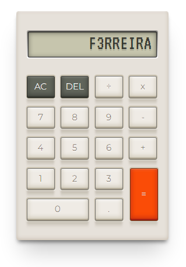

<h1 align="center">
Calculadora
</h1>
 

## 🗂️ Projeto

A [Calculadora](https://f3rreira.github.io/Calculadora2) é uma aplicação WEB para a realização de cálculos numéricos, com a capacidade de realizar as quatro operações básicas da matemática:  adição, subtração, multiplicação e divisão.

## 💻 Tecnologias

Esse projeto foi desenvolvido utilizando as seguintes tecnologias:

- HTML
- CSS
- JavaScript

## 🌎 Publicação

Você pode acessar a página [Calculadora](https://f3rreira.github.io/Calculadora2) para testar e ver mais detalhes.

## :memo: Licença

Esse projeto está sob a licença MIT. Veja o arquivo [LICENSE](LICENSE.md) 

---
 

 
 

